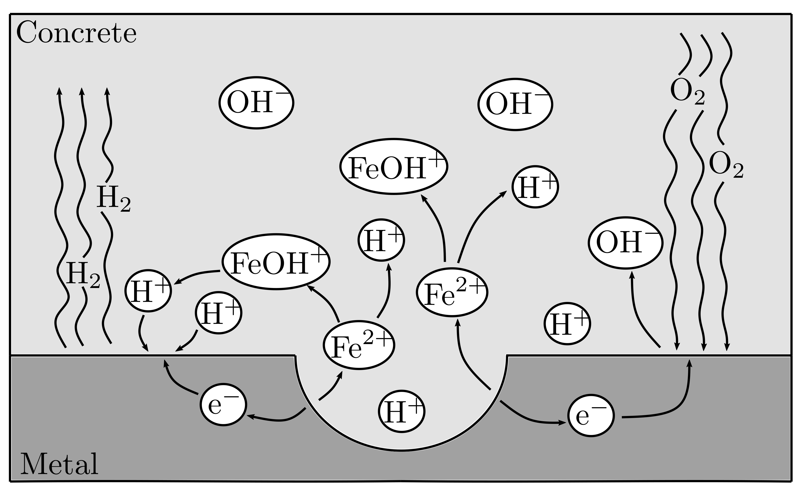
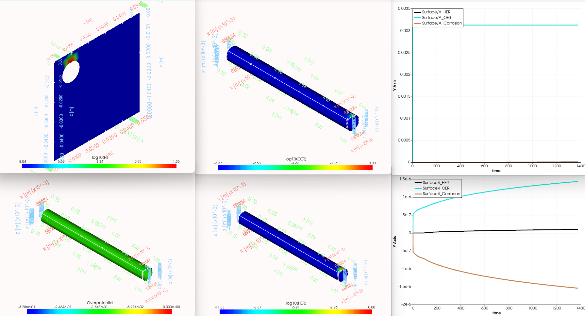

# ConcreteCorrosion

## Documentation

Finite element simulations for modelling the corrosion of rebar within concrete, considering the localisation of hydrogen, oxygen, and corrosion reactions under the conditions of natural corrosion. For detailed information about the project, including installation instructions, usage, and technical details, please refer to the [documentation](Documentation/Doc.pdf).

## Citation

If you find this project useful in your research or work, please consider citing the following paper:

> T Hageman, C Andrade, E Martinez-Paneda, *Corrosion of metal reinforcements within concrete and localisation of supporting reactions under natural conditions*, Electrochimica Acta, 2025. https://doi.org/10.1016/j.electacta.2025.146203

## Installation and Usage

To install and use this project, follow the instructions provided in the [documentation](Documentation/Doc.pdf). This includes details on dependencies, setup, and running the simulation.

